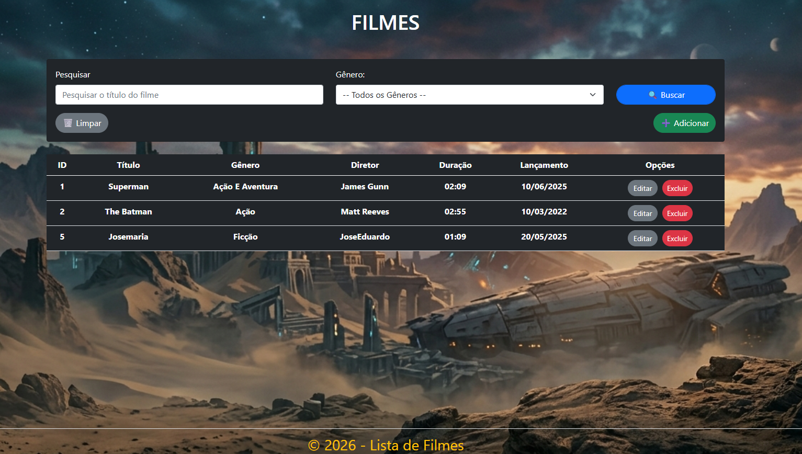

🎬 Lista de Filmes — ASP.NET Core MVC
Este é um sistema de gerenciamento de filmes (CRUD) desenvolvido para demonstrar competências em desenvolvimento backend com o ecossistema .NET, integração com banco de dados SQL Server e manipulação dinâmica de interface.

🚀 Funcionalidades
CRUD Completo: Cadastro, listagem, edição e exclusão de filmes.

Busca Dinâmica: Filtros simultâneos por título e gênero.

Destaque de Busca (Highlight): Script personalizado para destacar o termo pesquisado na tabela.

Interface Responsiva: Desenvolvida com Bootstrap para adaptação em diferentes tamanhos de tela.

Gerenciamento de Identidade: Lógica de RESEED para reiniciar a contagem de IDs ao esvaziar a tabela.

🛠️ Tecnologias Utilizadas
Linguagem: C#

Framework: ASP.NET Core 8 MVC

ORM: Entity Framework Core

Banco de Dados: SQL Server
  
Frontend: HTML5, CSS3, JavaScript e Bootstrap

A imagem do projeto
  
Arquitetura: MVC (Model-View-Controller)

🏗️ Como rodar o projeto
Clonar o repositório:

Bash
git clone https://github.com/claubercorrea/ListaFilme.git
Configurar o Banco de Dados:
Verifique a ConnectionString no arquivo appsettings.json e ajuste para o seu servidor local.

Executar as Migrations:
No Console do Gerenciador de Pacotes, execute:

Bash
Update-Database 
Rodar a aplicação:
Pressione F5 no Visual Studio ou execute dotnet run.

📂 Estrutura do Projeto
Controllers/: Lógica de controle e rotas da aplicação.

Models/: Definição das classes de dados e regras de validação.

Data/: Contexto do Entity Framework e configurações de banco.

Views/: Páginas da interface (Razor Pages).

wwwroot/: Arquivos estáticos (CSS, JS, Imagens).